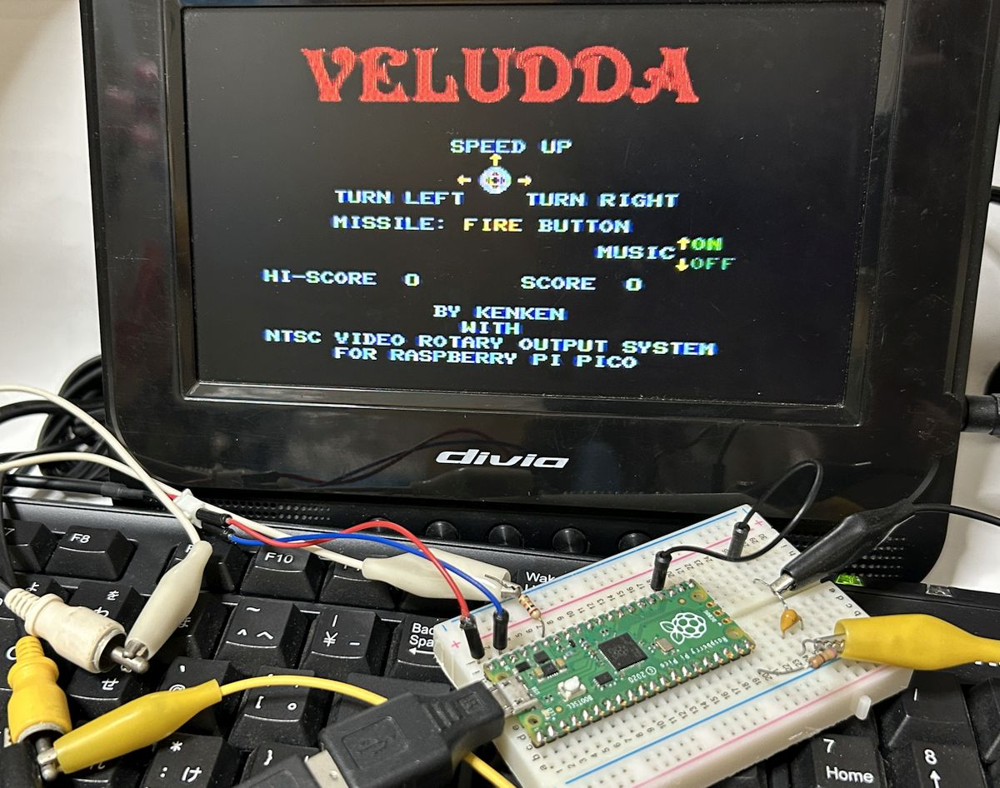
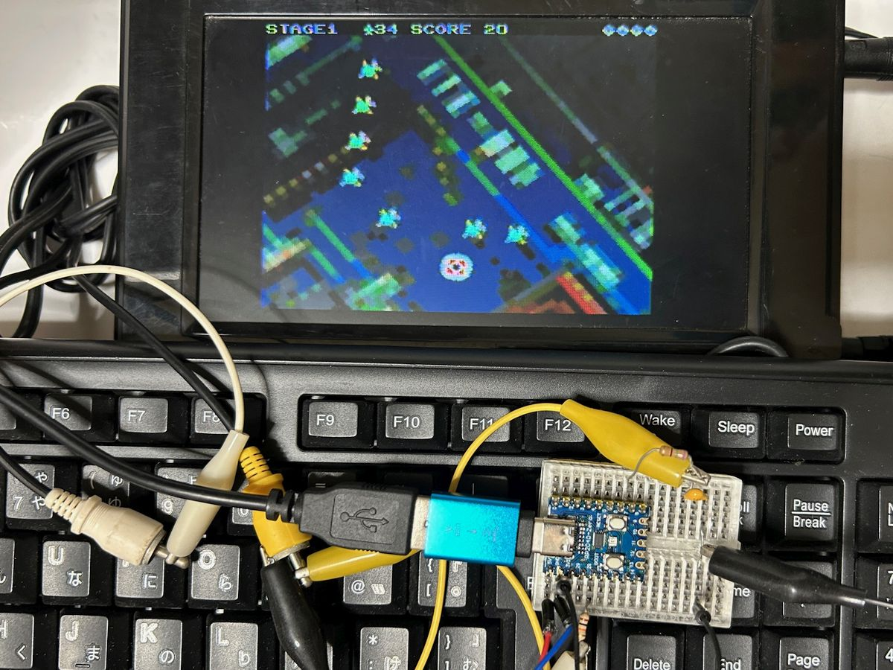
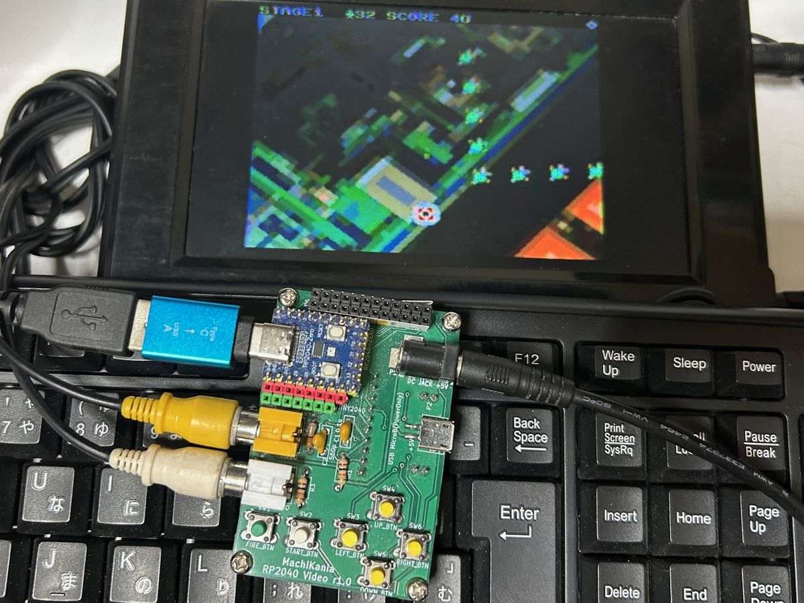
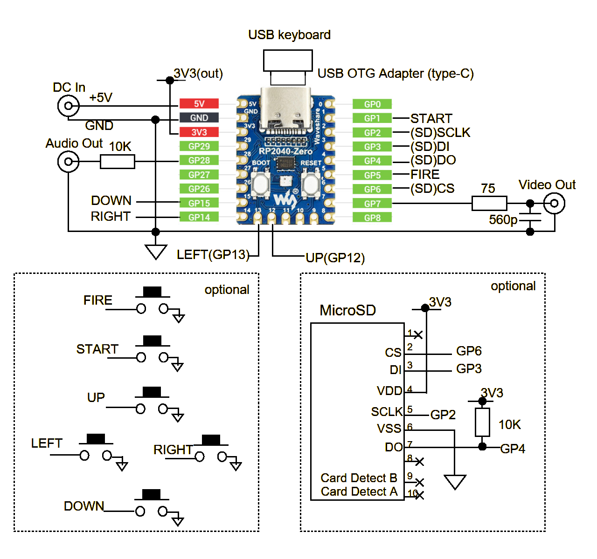
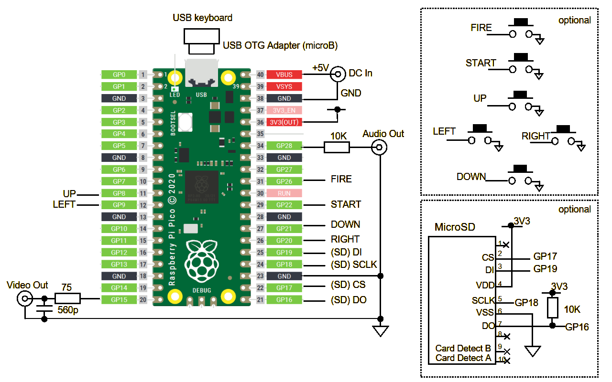

# VELUDDA for Raspberry Pi Pico (Rotating scroll shooting game, for RP2040 NTSC Video)
  
VELUDDAは画面全体が回転しながらスクロールする私のオリジナルのシューティングゲームです。Raspberry Pi Pico / Pico 2およびWaveshare RP2040-Zero、Seeed Studio XIAO RP2040、Pimoroni Tiny2040やそのRP2350搭載版等でも動作します。ソフトウェア的にNTSCカラービデオ信号と音声信号を生成しており、抵抗2本、コンデンサ1本だけでAV入力対応テレビ等に接続して楽しむことができます。ゲーム操作はUSBキーボードまたは6個のボタンで行います。  
  
RP2040-Zeroでの実行画面  
  
## 実行ファイル
Releasesから実行用uf2ファイルをダウンロードし、PCとUSBケーブルで接続して書き込んでください。binディレクトリにも同じものがあります。書き込むマイコンボードの種類によりそれぞれ以下のファイルを使用します。  
* veludda-rpp2040.uf2　Raspberry Pi Pico、Raspberry Pi Pico W
* veludda-rpp2350.uf2　Raspberry Pi Pico 2、Raspberry Pi Pico 2 W
* veludda-xiao2040.uf2　XIAO RP2040、Tiny2040、RP2040-Zero
* veludda-xiao2350.uf2　XIAO RP2350、Tiny2350、RP2350-Zero

BASICマイコンシステムMachiKania type PUでもuf2ファイルを書き込むことでプレイできます。MachiKania type PU基板ではveludda-rpp2040.uf2またはveludda-rpp2350.uf2、MachiKania type PU mini基板ではveludda-xiao2040.uf2またはveludda-xiao2350.uf2を書き込んでください。  

MachiKania type PU mini基板  
  
## 接続
RP2040-ZeroおよびRaspberry Pi Picoでの回路図はそれぞれ以下のようになります。6個のボタンはなくてもUSBキーボードでプレイ可能です。XIAO RP2040、Tiny2040についてはRP2040-Zeroの回路を参考にしてください。ただし、ポートが少ないためボタンが使えませんので、USBキーボードでのプレイのみとなります。Pico 2等RP2350搭載ボードも基本的に接続は同じです。  
ビデオ信号はRP2040-Zero、XIAO RP2040、Tiny2040ではGP7に、Raspberry Pi PicoではGP15に出力します。テレビのビデオ入力端子に接続すると映像が出ます。  
音声信号はモノラルでGP28に出力するので、テレビの音声入力端子等に接続してください。  
USBキーボードはUSB OTG（On The Go）アダプタを介してUSBポートに接続します。  
マイクロSDカードはオプションです。カードにビットマップファイルを保存することで背景画像を自由に変更することができますが、なくても標準画像でプレイ可能です。  
電源は5VのACアダプタ等を各マイコンの電源端子に接続してください。消費電流は少ないので500mAもあれば十分です。また、給電端子のあるUSB OTGケーブルを利用すればUSB端子から給電できるので接続が簡単となります。  
BASICマイコンシステムMachiKania type PUやMachiKania type PU miniと接続は同じのため、これらのシステムではuf2ファイルを書き込むだけでそのまま利用できます。  
  
RP2040-Zero用回路図
  
  
Raspberry Pi Pico用回路図
  
## 遊び方
実行ファイル書き込み後、テレビ、キーボードを接続して電源オンするとタイトル画面が表示され、EnterキーまたはSTARTボタンを押すとゲーム開始です。ゲームでは以下を使用します。  
  
* スペースキーまたはFIREボタン　ミサイル発射  
* 左右矢印キーまたはLEFT,RIGHTボタン　旋回  
* 上矢印キーまたはUPボタン　加速  
  
ゲーム開始するとすぐに、敵が編隊を組んで現れます。ミサイルを発射して、やっつけてください。敵機に衝突すると自機が1機減ります。敵機を全滅させるとステージクリアです。マップの上下端、左右端はつながっているので、飛んでいるとやがて一周します。  
ステージ2からは地上から砲弾が撃たれます。砲弾は狙って飛んできますので、必ず避けてください。  
ゲームの詳しい説明は参考リンクのPIC32MX版VELUDDAのページを参照願います。  
## 背景画像
マイクロSDカードのルートディレクトリに「VELUDDA.BMP」ファイルを保存しておくと、背景画像を変更することが可能です。ファイル形式は横512ドット、縦256ドット、8ビットカラーのBMPファイルです。ただし色数は128色以下とする必要があります。サンプルファイルがあるのでお試しください。  
マイクロSDカードのアクセスにはChaN氏の[FatFSモジュール](https://elm-chan.org/fsw/ff/)を利用しています。  
## 参考リンク
[Raspberry Pi Pico＋液晶版VELUDDA](https://github.com/KenKenMkIISR/veludda_lcd)  
[PIC32MX版VELUDDA](http://www.ze.em-net.ne.jp/~kenken/veludda/index.html)  
[PIC32MX版プレイ動画](https://youtu.be/S2RQJJL0LQA)  
